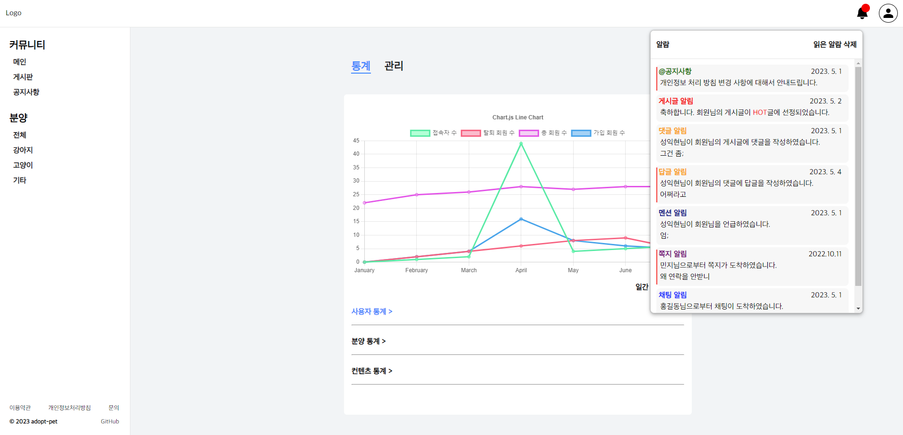
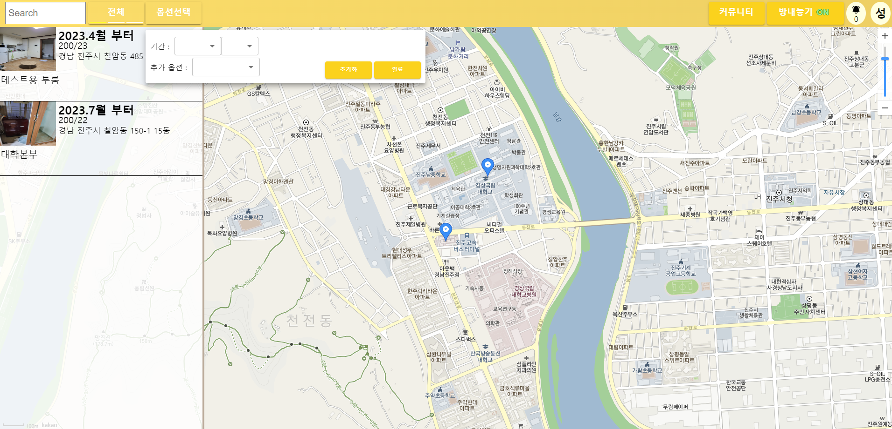
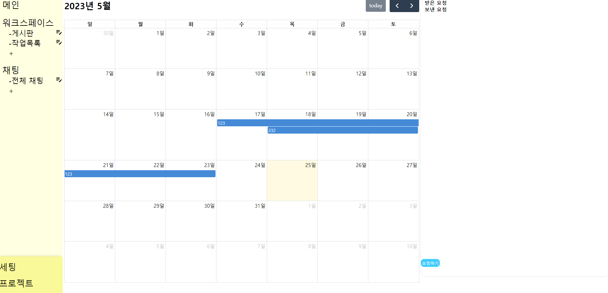
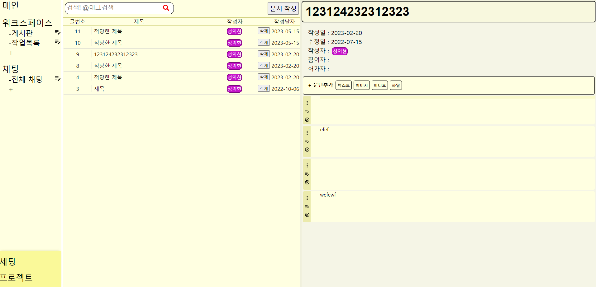
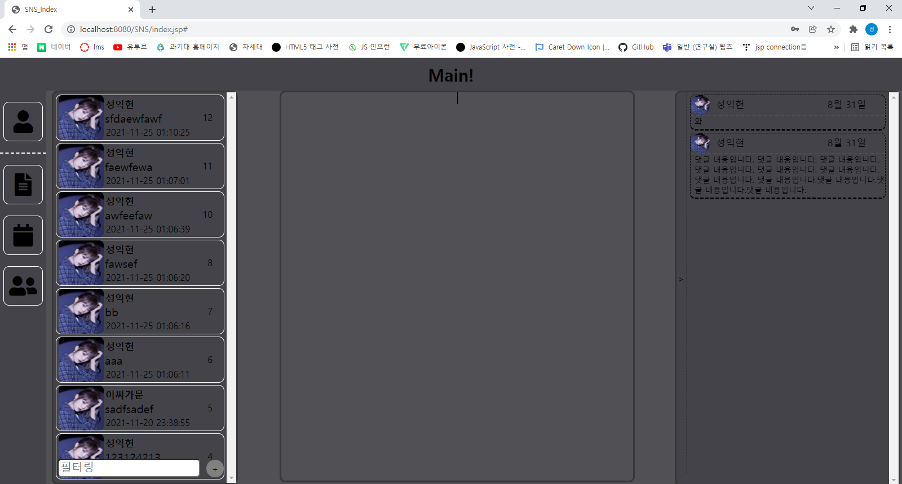

# **성익현 | Front-End Developer**

|  |  |
| :---------------------------------------------------------------------------------------------------------------------: | :-------------------------------------------------------------------------------------------------------------------: |
|                                                                                                                         |                                                                                                                       |

## **Information**

- <b>E-mail</b> : skantrkwl789@naver.com
- <b>GitHub</b> : https://github.com/ikhyeons
- <b>Phone</b> : 010-8689-1432

## **Introduction**

신입 개발자로 <b>Web 개발</b>에 관심이 있으며, <b>Front-End</b> 개발자를 목표로 하고 있습니다. 
시간이 날 때 마다 작은 개인 프로젝트들을 진행하고 있으며, 가끔 팀 프로젝트를 진행합니다. 
<b>꼼꼼한 기획과 설계</b>를 기반으로 프로젝트를 구현하는 것을 선호합니다. 
새로운 기술을 <b>학습</b>하고 <b>도전</b>하는 것을 좋아합니다. 

## **Skills**

- <b>Front-End</b> : JavaScript, TypeScript, React.js, Next.js, HTML/CSS, Jest, RTL
- <b>Back-End</b> : Node.js, Express.js
- <b>Database</b> : MySQL
- <b>Deploy</b> : Git Actions
- <b>Collaboration</b> : Notion, Git

## **Education**

<b>2018.03 ~ 2024.02</b> : 경상국립대학교 융합기술공과대학 융합전자공학부 (졸업예정)

## **Project & Experience**

- ### **분양 플랫폼 팀 프로젝트**

  - <b>Period</b> : 23.05.01 ~
  - <b>GitHub</b> : https://github.com/adopt-pet-project
  - <b>Position</b> : Front-End / Modals, My Page, Admin Page
  - <b>Summary</b> : 강아지, 고양이, 기타 동물들을 분양하는 이용자들 간에 커넥션을 만들어 주는 플랫폼
  - <b>Function</b> : 동물 분양, 게시판, 마이 페이지(분양 확인), 채팅, 쪽지, 로그인
  - <b>Skills</b> : TypeScript, Next.js, Recoil.js, React-Query, SCSS, JWT
  - <b>View</b> : 

---

- ### **자취방 양도 플랫폼 개인 프로젝트**

  - <b>Period</b> : 22.12.06 ~ 23.04.22
  - <b>GitHub</b> : https://github.com/ikhyeons/realEstate
  - <b>Summary</b> : 자취생들 간에 원룸을 양도하려면 에브리타임과 같은 일반 커뮤니티를 이용하였는데, 이러한 양도 시스템을 분리한 플랫폼
  - <b>Function</b> : 지도에서 방 확인하기, 방 내놓기, 게시판, 채팅, 로그인
  - <b>Skills</b> :
    - Front-End : TypeScript, React.js, Recoil.js, React-Query, Styled-Components, WebPack
    - Back-End : Express.js, MySQL, MySQL-Session, Socket.io
  - <b>Brief</b> : 2023.02 Free-Teer 기한 만료로 RDS, S3에서 저장하던 데이터를 로컬로 이전
  - <b>View</b> : 

---

- ### **텔로드론과 웹 연동 캡스톤 디자인**

  - <b>Period</b> : 22.10.06 ~ 22.12.05
  - <b>GitHub</b> : https://github.com/ikhyeons/DroneWithReact
  - <b>Summary</b> : 텔로 드론을 웹과 연결하여 상태 표시
  - <b>Function</b> : 텔로드론 연결, 상태 확인, 기기 간 UDP통신, openCV를 이용한 영상처리
  - <b>Skills</b> :
    - Front-End : React.js, Styled-Components
    - Back-End : Express.js, Socket.io, Python, UDP
  - <b>View</b> : 
    

---

- ### **협업툴 개인 프로젝트**

  - <b>Period</b> : 22.05.18 ~ 22.10.06
  - <b>GitHub</b> : https://github.com/ikhyeons/collab
  - <b>Summary</b> : 콜라비, 노션을 참고하여 협업툴을 제작
  - <b>Function</b> : 프로젝트 만들기, 협업자 추가하기, 일정 달력에 CRUD, 게시글 CRUD, 게시글 문단 DnD 순서 변경, 로그인, 채팅, 멘션, 카테고리, 채팅방 CRUD
  - <b>Skills</b> :
    - Front-End : React.js, Recoil.js, React-Query, Styled-Components
    - Back-End : Express.js, MySQL, MySQL-Session, Socket.io, AWS RDS, S3
  - <b>View</b> : 
    
    

---

- ### **첫 프로젝트 SNS**

  - <b>Period</b> : 21.08 ~ 22.05
  - <b>GitHub</b> : https://github.com/ikhyeons/SNSnew
  - <b>Summary</b> : SNS 프로젝트
  - <b>Function</b> : 게시판, 친구추가, 댓글작성, 게시글 검색, 메모, 로그인
  - <b>Skills</b> :
    - Front-End : HTML/CSS/JS, JSP
    - Back-End : MySQL, JAVA
  - <b>View</b> : 
    

---
